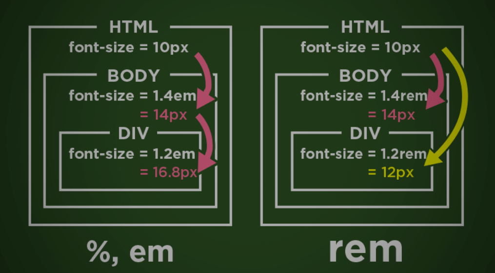

# TIL : HTTP와 CSS 기본02
> 01은 정리 안했다!!

1. [HTML 파일 수정과 BootStrap 연결](#1-html-파일-수정과-bootstrap-연결)

2. [Google Fonts 적용](#2-google-fonts-적용)

3. [HTML 파일을 CSS+HTML로 분리하기](#3html-파일을-csshtml로-분리하기)

4. [CSS 간단 핵심](#4-css-간단-핵심)

---

## 1. HTML 파일 수정과 BootStrap 연결

[BootStrap-QuickStart-링크](https://getbootstrap.com/docs/4.3/getting-started/introduction/)

>모든 HTML을 각 개발자가 하나부터 열까지 전부 다 만든다..?\
>개발자 죽는다.그래서 트위터에서 만든 에셋을 링크로 활용해 개발자들을 살리자!

**사용(QuickStart- 기본)**

1. CSS Link를 `head.html` 에 적용시킴


```python
<!-- head.html -->
<head>
    <meta charset="UTF-8">
    <title>Pragmatic</title>

    <!-- BootStrap Link -->
    <link rel="stylesheet" href="https://cdn.jsdelivr.net/npm/bootstrap@4.3.1/dist/css/bootstrap.min.css" integrity="sha384-ggOyR0iXCbMQv3Xipma34MD+dH/1fQ784/j6cY/iJTQUOhcWr7x9JvoRxT2MZw1T" crossorigin="anonymous">

</head>
```

## 2. Google Fonts 적용

[Google Fonts-링크](https://fonts.google.com/)

웹 페이지 폰트 적용을 위해 사용. Title, Footer 에 적용함

사용방법

1. 원하는 폰트 찾기

2. `Select Regular` 버튼 / 아니면 우측상단 4개 사각형

3. `head.html` 에 Link 적용

4. 원하는 CSS 위치에 `fontfamily: 'xxx','xxx'` 적용


```python
<!-- head.html -->
<head>
    <meta charset="UTF-8">
    <title>Pragmatic</title>

    <!-- BootStrap Link -->
    <link rel="stylesheet" href="https://cdn.jsdelivr.net/npm/bootstrap@4.3.1/dist/css/bootstrap.min.css" integrity="sha384-ggOyR0iXCbMQv3Xipma34MD+dH/1fQ784/j6cY/iJTQUOhcWr7x9JvoRxT2MZw1T" crossorigin="anonymous">

    <!-- Google.Fonts-Lobster Link -->
    <link rel="preconnect" href="https://fonts.googleapis.com">
    <link rel="preconnect" href="https://fonts.gstatic.com" crossorigin>
    <link href="https://fonts.googleapis.com/css2?family=Lobster&display=swap" rel="stylesheet">

</head>
```


```python
<div class="Main_align">
    <div>
        <h1 style="font-family:'Lobster', cursive;">
            Pragmatic
        </h1>    
    </div>
</div>
```

## 3.HTML 파일을 CSS+HTML로 분리하기

스테틱 먼저 적용해야함\
자주 변경되지 않는 에셋, 파일을 통칭=스테틱

앱별로 따로 관리함

`settings.py` 안에


```python
#settings.py
STATIC_URL = 'static/'

STATIC_ROOT = os.path.join(BASE_DIR, 'staticfiles')
```


```python
# 이후 git bash에서

$ python manage.py collectstatic

#프로젝트 내부의 모든 static 파일을 한 곳으로 모아줌
```

[장고문서-링크](https://docs.djangoproject.com/en/4.2/howto/static-files/) 에 따르면 프로젝트와 별개로 관리할 수 있는 StaticFiles들을 관리할 수 있다고 함


```python
# settings.py

STATIC_URL = 'static/'

STATIC_ROOT = os.path.join(BASE_DIR, 'staticfiles')

STATICFILES_DIRS = [
    BASE_DIR / "static", 
]
```

이후

1. 프로젝트 폴더(앱아님) 내부에 `static` 폴더 생성, `base.css` 생성

2. `xxx.html` 내부의 `style` 복사, 삭제

3. `<h6 style='xxxx'>` 를 `<h6 class="">` 로 변경하기!! (클래스 적용)

4. `base.css` 로 이동 해당 클래스 설정

5. 단 클래스 선언은 `.` 으로 한다.


```HTML
<!-- base.css -->
.pragmatic_footer_logo{
    font-family: 'Lobster', cursive;
}
```

6. `base.css`를 해당 `.html` 내부에 선언
    1. 링크를 선언하는 `head.html` 최상단에
    2. `` 추가
    3. 하단에 아래와 같이 추가


```HTML


<!-- Default css Link -->
<link rel="stylesheet" type="text/css" href=""
```

이제 `.css` 파일 내부에 `style` 들을 집합시킬 수 있다.

### 전체 흐름을 정리하자면,

1. `settings.py` 에서 `static` 선언 -> 이로써 `.html`과 `.css` 를 연결시킬 수 있다.

2. `.html` 내부에서 `class` 를 선언 -> 내부의 `style` 들을 모두 `.css`에서 처리함

3. `head.html` 내부에서 해당 `.css`가 있는 `static` 호출

4. `head.html` 내부에서 해당 `.css` 호출 

5. 적용되는 `.class` 선언.

## 4. CSS 간단 핵심

**C**: ascading\
**S**: tyle\
**S**: heet\

HTML을 꾸미는 디자인 언어 묶음

### Display Attribute

디스플레이 속성들이 화면 구성을 정의함

- Block
- Inline
- Inline-Block
- None

### Visibility

- Hidden

### SIZE

- px
- em
- rem <------ 제일 많이 씀
- %


[이미지출처](https://smazee.com/blog/css-units-px-em-rem-vh-vw-vmin-vmax)


### 실습

`.html` 파일 내부에서 Class 선언도 가능함


```HTML
<style>
    .testing{
        background-color: white
    }
</style>
```
